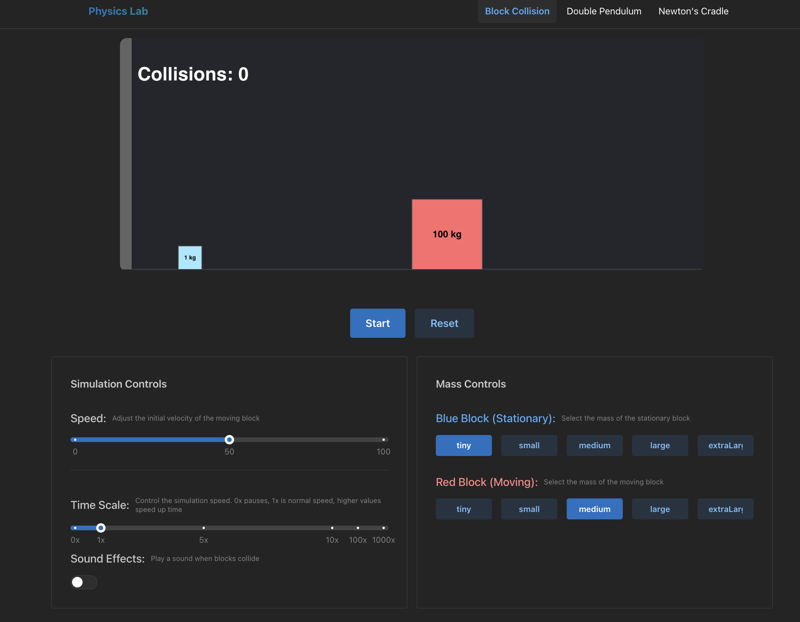
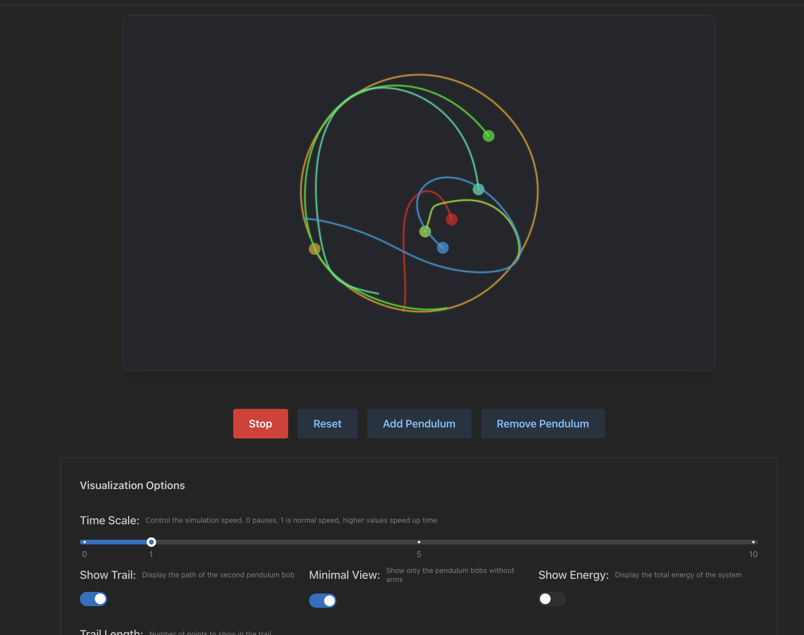
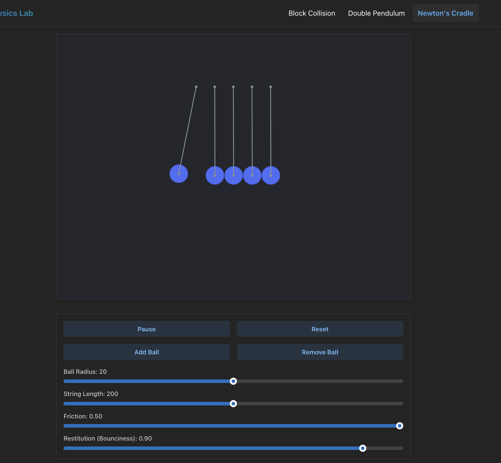
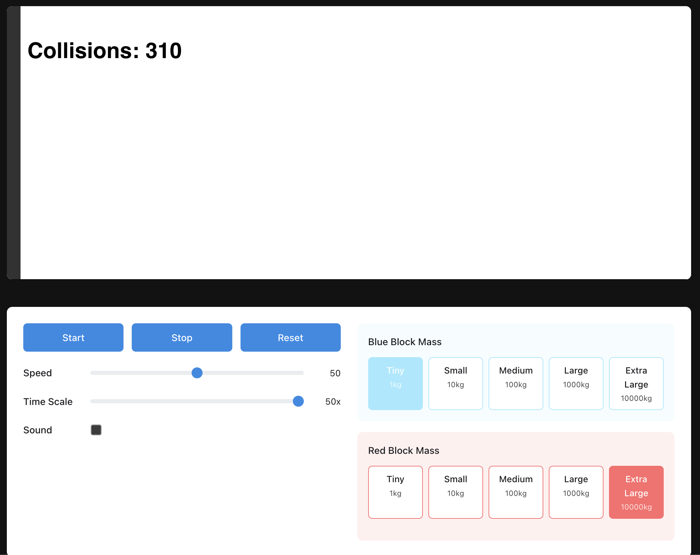
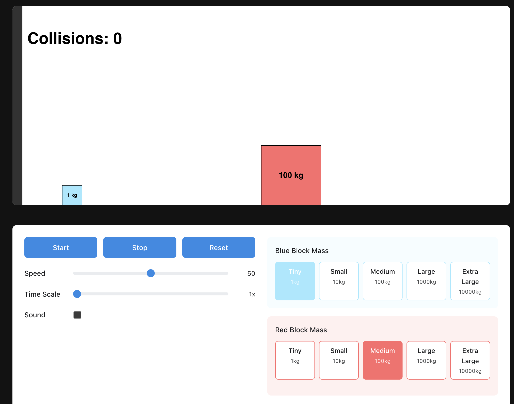

# Physics Simulation Lab

A collection of interactive physics simulations built with React, TypeScript, and p5.js.

## Available Simulations

### 1. Collision Simulator


Explore elastic collisions between objects of different masses and visualize conservation of momentum and energy. The simulation demonstrates how momentum and kinetic energy are conserved during perfectly elastic collisions.

### 2. Double Pendulum Chaos


Witness the fascinating chaotic behavior of a double pendulum system. Adjust initial conditions and physical parameters to explore how small changes can lead to dramatically different outcomes.

#### Features:
- Real-time physics simulation using Lagrangian mechanics
- Adjustable initial conditions (angles and angular velocities)
- Customizable physical parameters (masses, lengths, gravity, damping)
- Visual trail of the second pendulum bob
- Phase space visualization
- Energy conservation monitoring
- Time scale control
- Interactive controls with immediate feedback

### 3. Newton's Cradle


Experience the classic demonstration of conservation of momentum and energy with this interactive Newton's Cradle simulation. Observe how energy transfers through the system and how the number of balls affects the resulting motion.

### 4. Particle Interactions


Explore the behavior of particles under various force fields and interactions. This simulation allows you to:
- Create and manipulate multiple particles
- Apply different types of forces (gravitational, electric, magnetic)
- Observe particle trajectories and interactions
- Adjust physical parameters in real-time

## Main Interface


The application features a clean, modern interface built with Mantine UI components, making it easy to:
- Switch between different simulations
- Adjust simulation parameters
- View real-time data and visualizations
- Control simulation playback

## Getting Started

1. Clone the repository
2. Install dependencies:
   ```bash
   npm install
   ```
3. Start the development server:
   ```bash
   npm start
   ```
4. Open your browser and navigate to `http://localhost:5173`

## Technologies Used

- React
- TypeScript
- p5.js
- Mantine UI
- Vite
- Electron (for desktop application)

## Contributing

Contributions are welcome! Please feel free to submit a Pull Request.

## License

This project is licensed under the MIT License - see the LICENSE file for details. 